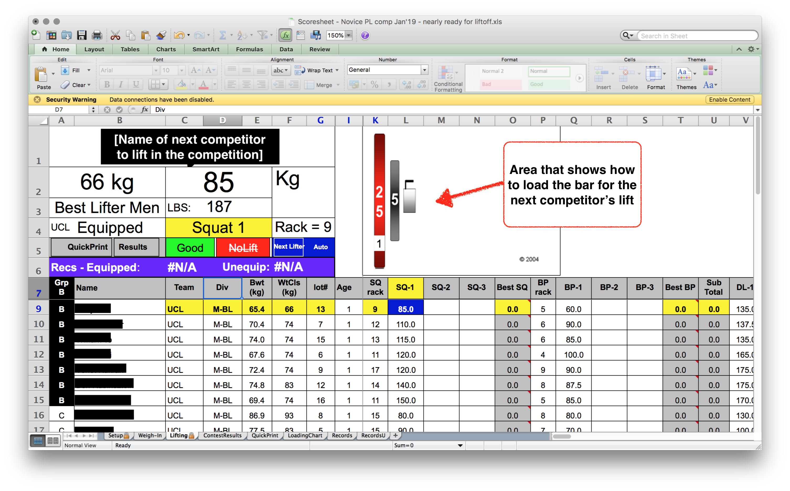

# Untitled Powerlifting Scoring App (aka comp-day)

In the past I have volunteered to score powerlifting competitions in London, both university and official IPF divisional competitions. Typically this was done using a really old Excel spreadsheet that was copied and passed between powerlifters as needed:

It was buggy but necessary because of the work needed to:
- allow easy data entry of competitor's details on the morning of a competition
- determine the order of competitors for each flight* based on past successful lifts
- allow data entry of competitors' attempt selections* throughout the competition
- automated calculation of competitors scores throughout the day

In this project I want to make an online powerlifting scoring tool, as it's a non-trivial side project to practice web development, but also hopefully benefit amateur powerlifting competitions. Other online powerlifting scoring tools have been produced online in the past, but they were not very intuitive. Or perhaps there are others but they're not very discoverable via Google or powerlifting social groups.

\* see Glossary at the end of the README

## Approach

### Frontend
Using React : I'm going to create a React app with stubbed data to start, where I can get experience managing complex state (maybe using Redux?).
TDD: I'm going to be strict and use TDD through this project.

### Backend
At some point I'll create a backend, and am yet to decide the approach (SQL/NoSQL etc).

### Deployment
And along the way I'm going to invesitgate hosting it on GCP.

## Glossary

| Word | Meaning|
|------|--------|
|attempt| One of the 3 'goes' a competitor gets for a given _event_.|
|event| AKA lift, or exercise. The 3 events are squat, bench press and deadlift.|
|flight| A group of lifters taking turns to attempt a lift. Everyone in a flight takes their first attempts in weight order, and then everyone begins their second attempt, etc.|
|good lift| An attempt at a lift that has satisfied the referees, who judge whether a lift was competed successfullt in accordance with the technical rules.|
|no lift| An attempt at a lift that has been deemed unsuccessful, either due to failure to lift the weight or unsatisfactory technique that isn't in accordance with the technical rules. E.g. a deadlift where the competitor does not lower the bar in a controlled fashion|
|powerlifting| A strength sport where competitors get 3 _attempts_ to lift as much weight as possible in squat, bench press and deadlift exercises. Scores are created by summing the heaviest weight lifted for each one (See _total_).|
|total| The sum of a competitor's heaviest successful squat + heaviest successful bench press + heaviest successful deadlift. See _good lift_)|

